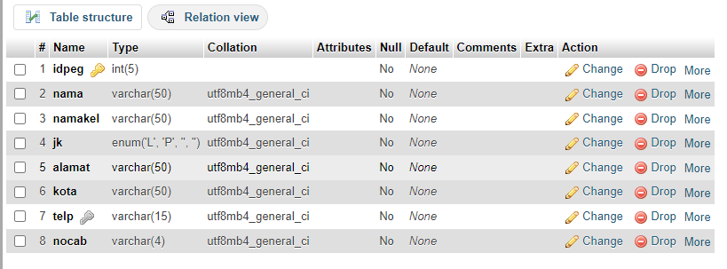

# Struktur Pegawai


# Data Pegawai

## Before

## After

# Cabang
## Before 


## After


# Relasi 


```mysql
SELECT m.nama AS Nama_Murid, n.nilai AS Nilai FROM nilai AS n INNER JOIN murid AS m ON m.nis = n.id_siswa WHERE n.nilai > 75;
```

Penjelasan:

- SELECT m.nama AS Nama_Murid, n.nilai AS Nilai:

Ini menunjukkan bahwa kita akan mengambil dua kolom dalam hasil query:
Nama_Murid: Nama murid yang diambil dari tabel murid.
Nilai: Nilai yang diambil dari tabel nilai.

- FROM nilai AS n:

Ini menunjukkan bahwa data awal diambil dari tabel nilai dengan alias n.

- INNER JOIN murid AS m ON m.nis = n.id_siswa:

Ini adalah operasi INNER JOIN yang menghubungkan tabel nilai dan tabel murid berdasarkan kondisi m.nis = n.id_siswa.
Artinya, data dari kedua tabel akan digabungkan berdasarkan kecocokan nilai pada kolom nis di tabel murid dan id_siswa di tabel nilai.

- WHERE n.nilai > 75:

Ini adalah kondisi tambahan yang diterapkan pada hasil join tabel.
Kondisi ini memastikan bahwa hanya murid yang memiliki nilai lebih besar dari 75 yang akan ditampilkan dalam hasil query.

Jadi, query ini akan menampilkan nama murid dan nilai mereka, tetapi hanya untuk murid yang memiliki nilai lebih besar dari 75. Data diambil dengan menggabungkan tabel nilai dan tabel murid berdasarkan kecocokan nilai pada kolom nis dan id_siswa.

Sebagai contoh, jika hasil query menunjukkan:

Nama Murid: Budi, Nilai: 85

Nama Murid: Siti, Nilai: 90

Nama Murid: Andi, Nilai: 80

Maka hanya murid Budi, Siti, dan Andi yang akan ditampilkan, karena mereka memiliki nilai lebih besar dari 75.
