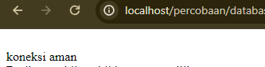
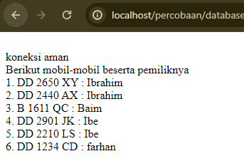
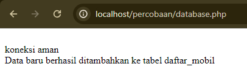
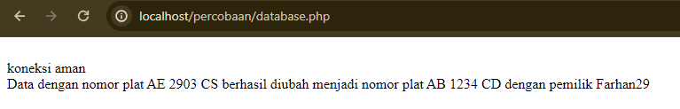
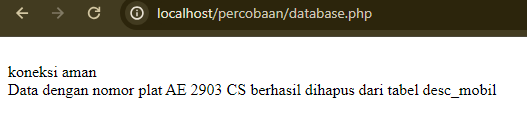
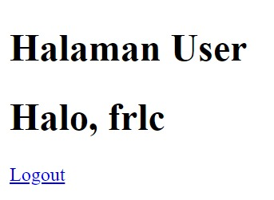
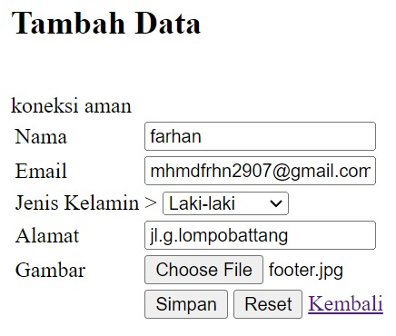
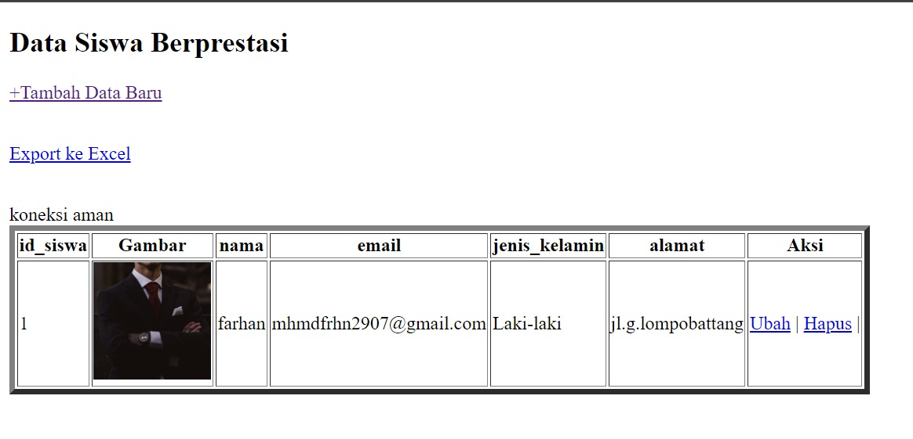

# Koneksi Database
## Kode Program

```php
<?php

  

//koneksi ke database

$koneksi = mysqli_connect('localhost', 'root', '', 'rental_mobil');

  

if ($koneksi) {

    echo "<br> koneksi aman <br>";

} else {

    echo "error, tidak bisa koneksi ke database";

}
```

## Hasil



## Analisis

1. Kode ini bertujuan untuk menghubungkan aplikasi PHP dengan database MySQL yang bernama "rental_mobil" yang berada di localhost.
2. Koneksi ke database dilakukan menggunakan fungsi `mysqli_connect()` yang membutuhkan 4 parameter:
    - Hostname database: 'localhost'
    - Username database: 'root'
    - Password database: (kosong)
    - Nama database: 'rental_mobil'
3. Setelah koneksi dibuat, kode akan memeriksa apakah koneksi berhasil atau tidak.
    - Jika koneksi berhasil, maka akan ditampilkan pesan "koneksi aman".
    - Jika koneksi gagal, maka akan ditampilkan pesan "error, tidak bisa koneksi ke database".

## Kesimpulan

1. Kode ini merupakan langkah awal dalam membangun aplikasi PHP yang terhubung dengan database MySQL.
2. Koneksi ke database dilakukan dengan menggunakan fungsi `mysqli_connect()` yang membutuhkan informasi server, username, password, dan nama database.
3. Pengecekan koneksi dilakukan dengan menggunakan struktur percabangan `if-else` untuk menangani skenario koneksi berhasil dan koneksi gagal.
4. Kode ini memberikan dasar untuk melakukan operasi CRUD (Create, Read, Update, Delete) pada data yang disimpan dalam database "rental_mobil" menggunakan bahasa pemrograman PHP.


# Tampilkan Data

## Program 

```php
<?php

  

//koneksi ke database

$koneksi = mysqli_connect ('localhost', 'root', '', 'rental_mobil');

  

if ($koneksi) {

    echo "<br> koneksi aman <br>";

} else {

    echo "error, tidak bisa koneksi ke database";

}

//jalankan query seleksi

$select = mysqli_query($koneksi, "SELECT * FROM desc_mobil");

  

//membuat array asosiatif dan memecah data berdasarkan kolomnya

$result = mysqli_fetch_assoc($select);

  

//menampilkan struktur array dari data tabel yang dijalankan di atas

//var_dump($result);

  

echo 'Berikut mobil-mobil beserta pemiliknya<br>';

  

$a = 1;

foreach ($select as $key => $data) {

    echo $a++ . ". " . $data['no_plat'] . " : " . $data['pemilik'] . '<br>';

}

  

//echo '<p>Halo ' . $result['pemilik'] . '!!</p><br>';
```
## Hasil


## Analisis

1. Kode ini bertujuan untuk menghubungkan aplikasi PHP dengan database MySQL yang bernama "rental_mobil" yang berada di localhost.
2. Koneksi ke database dilakukan menggunakan fungsi `mysqli_connect()` yang membutuhkan 4 parameter:
    - Hostname database: 'localhost'
    - Username database: 'root'
    - Password database: (kosong)
    - Nama database: 'rental_mobil'
3. Setelah koneksi dibuat, kode akan memeriksa apakah koneksi berhasil atau tidak.
    - Jika koneksi berhasil, maka akan ditampilkan pesan "koneksi aman".
    - Jika koneksi gagal, maka akan ditampilkan pesan "error, tidak bisa koneksi ke database".
4. Selanjutnya, kode akan menjalankan query SQL untuk memilih semua data dari tabel "desc_mobil" menggunakan `mysqli_query()`.
5. Data hasil query disimpan dalam variabel `$select`.
6. Kemudian, kode akan membuat array asosiatif dari data hasil query menggunakan `mysqli_fetch_assoc()` dan disimpan dalam variabel `$result`.
7. Kode akan menampilkan struktur array dari data tabel "desc_mobil" menggunakan `var_dump()`.
8. Selanjutnya, kode akan menampilkan daftar nomor plat dan pemilik mobil yang ada dalam tabel "desc_mobil" menggunakan perulangan `foreach`.
9. Kode juga menyiapkan komentar untuk menampilkan salam kepada pemilik mobil, tetapi belum diaktifkan.
## Kesimpulan

1. Kode ini merupakan lanjutan dari kode sebelumnya, di mana setelah terhubung dengan database, kode akan melakukan operasi SELECT untuk mendapatkan data dari tabel "desc_mobil".
2. Data hasil query akan disimpan dalam variabel `$select` dan `$result` untuk kemudian ditampilkan.
3. Kode ini menunjukkan cara mengakses dan menampilkan data dari database menggunakan PHP.
4. Kode juga menyiapkan fitur untuk menampilkan salam kepada pemilik mobil, tetapi belum diaktifkan.
5. Secara keseluruhan, kode ini memiliki tujuan untuk menampilkan daftar mobil-mobil beserta pemiliknya yang tersimpan dalam database "rental_mobil".
# Tambahkan Data
## Program 

```php
<?php

  

//koneksi ke database

$koneksi = mysqli_connect ('localhost', 'root', '', 'rental_mobil');

  

if ($koneksi) {

    echo "<br> koneksi aman <br>";

} else {

    echo "error, tidak bisa koneksi ke database";

}

//jalankan query seleksi

$no_plat_baru = "AE 2903 CS";

$pemilik_baru = "FRLC";

$insert = mysqli_query($koneksi, "INSERT INTO desc_mobil (no_plat, pemilik) VALUES ('$no_plat_baru', '$pemilik_baru')");

if ($insert) {

echo "Data baru berhasil ditambahkan ke tabel daftar_mobil";

} else {

echo "Gagal menambahkan data baru ke tabel daftar_mobil";

}

  

//echo '<p>Halo ' . $result['pemilik'] . '!!</p><br>';
```
## Hasil


## Analisis

1. Kode ini bertujuan untuk menghubungkan aplikasi PHP dengan database MySQL yang bernama "rental_mobil" yang berada di localhost.
2. Koneksi ke database dilakukan menggunakan fungsi `mysqli_connect()` yang membutuhkan 4 parameter:
    - Hostname database: 'localhost'
    - Username database: 'root'
    - Password database: (kosong)
    - Nama database: 'rental_mobil'
3. Setelah koneksi dibuat, kode akan memeriksa apakah koneksi berhasil atau tidak.
    - Jika koneksi berhasil, maka akan ditampilkan pesan "koneksi aman".
    - Jika koneksi gagal, maka akan ditampilkan pesan "error, tidak bisa koneksi ke database".
4. Selanjutnya, kode akan menyiapkan data baru yang akan dimasukkan ke dalam tabel "desc_mobil" pada database "rental_mobil".
    - Nomor plat baru: "AE 2903 CS"
    - Pemilik baru: "FRLC"
5. Kemudian, kode akan menjalankan query SQL untuk menyisipkan (INSERT) data baru ke dalam tabel "desc_mobil" menggunakan `mysqli_query()`.
6. Setelah query dijalankan, kode akan memeriksa apakah data berhasil ditambahkan atau tidak.
    - Jika data berhasil ditambahkan, maka akan ditampilkan pesan "Data baru berhasil ditambahkan ke tabel daftar_mobil".
    - Jika data gagal ditambahkan, maka akan ditampilkan pesan "Gagal menambahkan data baru ke tabel daftar_mobil".
7. Kode juga menyiapkan komentar untuk menampilkan salam kepada pemilik mobil, tetapi belum diaktifkan.
## Kesimpulan

1. Kode ini merupakan lanjutan dari kode sebelumnya, di mana setelah terhubung dengan database, kode akan melakukan operasi INSERT untuk menambahkan data baru ke dalam tabel "desc_mobil".
2. Data baru yang akan ditambahkan adalah nomor plat "AE 2903 CS" dan pemilik "FRLC".
3. Kode ini menunjukkan cara memasukkan data baru ke dalam database menggunakan PHP.
4. Kode juga menyiapkan fitur untuk menampilkan salam kepada pemilik mobil, tetapi belum diaktifkan.
5. Secara keseluruhan, kode ini memiliki tujuan untuk menambahkan data mobil baru beserta pemiliknya ke dalam database "rental_mobil".
# Ubah Data
## Program 

```php
<?php

//koneksi ke database

 $koneksi = mysqli_connect('localhost', 'root', '', 'rental_mobil');

 if ($koneksi) { echo "<br> koneksi aman <br>";

 } else { echo "error, tidak bisa koneksi ke database"; }

  // Mengubah data dengan nomor plat tertentu

   $no_plat_lama = "AE 2903 CS";

    $no_plat_baru = "AB 1234 CD";

    $pemilik_baru = "Farhan29";

     $update = mysqli_query($koneksi, "UPDATE desc_mobil SET no_plat = '$no_plat_baru', pemilik = '$pemilik_baru' WHERE no_plat = '$no_plat_lama'");

      if ($update) { echo "Data dengan nomor plat $no_plat_lama berhasil diubah menjadi nomor plat $no_plat_baru dengan pemilik $pemilik_baru";

       } else { echo "Gagal mengubah data dengan nomor plat $no_plat_lama"; }

       ?>
```
## Hasil




## Analisis

1. Koneksi ke Database:
    
    - Kode melakukan koneksi ke database "rental_mobil" menggunakan fungsi `mysqli_connect()`.
    - Jika koneksi berhasil, maka akan menampilkan pesan "koneksi aman".
    - Jika koneksi gagal, maka akan menampilkan pesan "error, tidak bisa koneksi ke database".
2. Mengubah Data:
    
    - Kode menyiapkan data yang akan diubah, yaitu nomor plat lama "AE 2903 CS", nomor plat baru "AB 1234 CD", dan pemilik baru "Farhan29".
    - Kode akan menjalankan query SQL untuk mengubah data di tabel "desc_mobil" menggunakan perintah `UPDATE` dengan kondisi `WHERE no_plat = '$no_plat_lama'`.
    - Setelah query dijalankan, kode akan memeriksa apakah data berhasil diubah atau tidak.
        - Jika data berhasil diubah, maka akan menampilkan pesan "Data dengan nomor plat $no_plat_lama berhasil diubah menjadi nomor plat $no_plat_baru dengan pemilik $pemilik_baru".
        - Jika data gagal diubah, maka akan menampilkan pesan "Gagal mengubah data dengan nomor plat $no_plat_lama".
## Kesimpulan

Kode di atas berfungsi untuk mengubah data mobil di tabel "desc_mobil" pada database "rental_mobil". Kode ini dapat digunakan untuk mengubah nomor plat dan pemilik mobil berdasarkan nomor plat lama yang diinputkan. Jika proses perubahan data berhasil, maka akan ditampilkan pesan konfirmasi. Jika proses perubahan data gagal, maka akan ditampilkan pesan error.
# Hapus Data
## Program 

```php
<?php

  

//koneksi ke database

$koneksi = mysqli_connect ('localhost', 'root', '', 'rental_mobil');

  

if ($koneksi) {

    echo "<br> koneksi aman <br>";

} else {

    echo "error, tidak bisa koneksi ke database";

}

//jalankan query seleksi

$no_plat_dihapus = "AE 2903 CS";

$delete = mysqli_query($koneksi, "DELETE FROM desc_mobil WHERE no_plat = '$no_plat_dihapus'");

if ($delete) {

echo "Data dengan nomor plat $no_plat_dihapus berhasil dihapus dari tabel desc_mobil";

 } else {

echo "Gagal menghapus data dengan nomor plat $no_plat_dihapus dari tabel daftar_mobil";

}

  
  

//echo '<p>Halo ' . $result['pemilik'] . '!!</p><br>';

?>
```
## Hasil


## Analisis

1. Kode tersebut melakukan koneksi ke database "rental_mobil" menggunakan MySQLi.
2. Setelah koneksi berhasil, kode menyiapkan nomor plat mobil yang akan dihapus, yaitu "AE 2903 CS".
3. Kode kemudian menjalankan query SQL untuk menghapus data dari tabel "desc_mobil" berdasarkan nomor plat yang telah ditentukan menggunakan `mysqli_query()` dengan perintah `DELETE FROM`.
4. Setelah query dijalankan, kode akan memeriksa apakah data berhasil dihapus atau tidak.
    - Jika data berhasil dihapus, maka akan ditampilkan pesan "Data dengan nomor plat $no_plat_dihapus berhasil dihapus dari tabel desc_mobil".
    - Jika data gagal dihapus, maka akan ditampilkan pesan "Gagal menghapus data dengan nomor plat $no_plat_dihapus dari tabel daftar_mobil".
## Kesimpulan

Kesimpulan:  
Kode di atas berfungsi untuk menghapus data mobil dengan nomor plat "AE 2903 CS" dari tabel "desc_mobil" dalam database "rental_mobil". Jika penghapusan data berhasil dilakukan, maka akan ditampilkan pesan konfirmasi. Jika penghapusan data gagal, maka akan ditampilkan pesan error.
# Session / Login
## Program
```PHP
<?php

  

session_start();

  

if (isset($_POST['submit'])) {

    $username = $_POST['username'];

    $password = $_POST['password'];

  

    $koneksi = mysqli_connect('localhost', 'root', '', 'pemilu_test') or die('error koneksi');

  

    $result = mysqli_query($koneksi, "SELECT * FROM user

                            WHERE username = '$username' AND password = '$password'");

  

    $data = mysqli_fetch_assoc($result);

  

    if (isset($data)) {

        $_SESSION['username'] = $data['username'];

        $_SESSION['nama'] = $data['nama'];

        $_SESSION['status'] = 'login';

        header('Location: user.php');

    } else {

        echo "Username dan Password Salah";

    }

}

  
  

?>

<!DOCTYPE html>

<html>

  

<head>

    <title>Login Session</title>

</head>

  

<body>

  

    <form method="post">

        <label>Username</label>

        <input type="text" name="username">

        <br>

        <label>Password</label>

        <input type="text" name="password">

        <br>

        <button type="submit" name="submit">Login</button>

    </form>

  

</body>

  

</html>
```

```PHP
<?php

session_start();

  

if ($_SESSION['status'] == 'login' && $_SESSION['username'] == 'admin') {

    header("Location: admin.php");

}

if ($_SESSION['status'] != 'login') {

    header('Location: login.php');

}

  

?>

<!DOCTYPE html>

<html lang="en">

  

<head>

    <title>Document</title>

</head>

  

<body>

    <h1>Halaman User</h1>

  

    <h1>Halo, <?= $_SESSION['nama'] ?></h1>

    <a href="logout.php">Logout</a>

  

</body>

  

</html>
```

```PHP
<?php

if ($_SESSION['status'] == 'login' && $_SESSION['username'] != 'admin') {

    header("Location: user.php");

    exit();

} else if ($_SESSION['status'] == 'login' && $_SESSION['username'] == 'admin') {

    header("Location: admin.php");

}else{

    header("Location: session.php");

}
```

```php
<?php

session_start();

  

if ($_SESSION['status'] == 'login' && $_SESSION['username'] != 'admin') {

    header("Location: user.php");

}

  

if ($_SESSION['status'] != 'login') {

    header('Location: login.php');

}

  

?>

<!DOCTYPE html>

<html lang="en">

  

<head>

    <title>Document</title>

</head>

  

<body>

    <h1>Halaman Admin</h1>

  

    <h1>Halo, <?= $_SESSION['nama'] ?></h1>

    <a href="logout.php">Logout</a>

  

</body>

  

</html>
```
## Hasil




## Analisis
 Pada bagian PHP:
- Program memulai session dengan menggunakan fungsi session_start(). Hal ini penting untuk memulai dan mengelola session di PHP.
- Jika terdapat data yang dikirimkan melalui metode POST dengan nama "submit" (diperiksa menggunakan isset($_POST['submit'])), maka program akan melakukan proses login.
- Data username dan password yang dikirimkan melalui form diambil menggunakan $_POST['username'] dan $_POST['password'].
- Dilakukan koneksi ke database MySQL menggunakan mysqli_connect() dengan parameter host, username, password, dan nama database.
- Dilakukan query SQL untuk mencocokkan data username dan password yang diberikan dengan data di tabel "user" menggunakan perintah mysqli_query().
- Hasil query diambil menggunakan mysqli_fetch_assoc() dan disimpan dalam variabel $data.
- Hasil dari $data ditampilkan menggunakan var_dump() untuk tujuan debugging.
- Jika $data memiliki nilai (artinya username dan password cocok), maka session akan diset dengan variabel-variabel dari data tersebut, dan pengguna akan diarahkan ke halaman "user.php" menggunakan header('Location: user.php').
- Jika tidak ada data yang cocok, maka akan ditampilkan pesan "Username dan Password Salah".

Pada bagian HTML:
- Terdapat sebuah form dengan metode POST.
- Form tersebut memiliki input field untuk username dan password.
- Terdapat tombol "Login" yang akan mengirimkan data form saat ditekan.
## Kesimpulan
File session.php adalah program PHP yang melakukan proses login menggunakan session. Program ini memeriksa apakah data username dan password yang diberikan cocok dengan data yang ada di database. Jika cocok, session akan diset dengan variabel-variabel dari data tersebut dan pengguna akan diarahkan ke halaman "user.php". Jika tidak cocok, pesan kesalahan akan ditampilkan. Namun, perlu diperhatikan bahwa file ini belum mengimplementasikan fitur keamanan seperti sanitasi input dan penggunaan prepared statement untuk mencegah serangan SQL Injection.
# Upload & Download
### Program
```php
<!DOCTYPE html>

<html lang="en">

<head>

    <meta charset="UTF-8">

    <meta name="viewport" content="width=device-width, initial-scale=1.0">

    <title>index tabel</title>

</head>

<body>

    <h2>Data Siswa Berprestasi</h2>

    <a href="tambah.php">+Tambah Data Baru</a><br><br>

    <p>

        <a href="export.php">Export ke Excel</a>

    </p>

    <table border="5">

    <tr>

        <th>id_siswa</th>

        <th>Gambar</th>

        <th>nama</th>

        <th>email</th>

        <th>jenis_kelamin</th>

        <th>alamat</th>

        <th>Aksi</th>

    </tr>

  

    <?php

    include "koneksi.php";

    $i = 1;

    $query = mysqli_query($koneksi, "SELECT * FROM siswa");

    while ($data = mysqli_fetch_array($query)) {

    ?>

  

    <tr>

        <td><?php echo $i; ?></td>

        <td>

            " alt="gambar" width="100px">

        </td>

        <td><?php echo $data['nama']; ?></td>

        <td><?php echo $data['email']; ?></td>

        <td><?php echo $data['jenis_kelamin']; ?></td>

        <td><?php echo $data['alamat']; ?></td>

  

        <td>

            <a href="ubah.php?id=<?= $data['id_siswa']; ?>">Ubah</a> |

            <a href="hapus.php?id=<?= $data['id_siswa']; ?>">Hapus</a> |

        </td>

    </tr>

    <?php

    $i++;

    }

    ?>

    </table>

</body>

</html>
```
### Hasil






### Analisis
1. Kode program ini merupakan halaman utama (index) untuk menampilkan data siswa berprestasi yang disimpan dalam database.
2. Halaman ini terdiri dari beberapa elemen, yaitu:
    - Judul "Data Siswa Berprestasi"
    - Link "Tambah Data Baru" yang mengarah ke halaman "tambah.php"
    - Link "Export ke Excel" yang mengarah ke halaman "export.php"
    - Tabel yang menampilkan data siswa, meliputi: id_siswa, gambar, nama, email, jenis kelamin, dan alamat.
    - Tabel juga menampilkan aksi yang dapat dilakukan, yaitu "Ubah" dan "Hapus".
3. Data siswa ditampilkan dengan menggunakan perulangan `while` yang mengambil data dari tabel "siswa" di database.
4. Pada setiap baris data siswa, terdapat gambar, nama, email, jenis kelamin, dan alamat yang diambil dari tabel "siswa".
5. Tombol "Ubah" dan "Hapus" pada setiap baris data siswa akan mengarahkan pengguna ke halaman "ubah.php" dan "hapus.php" dengan membawa parameter ID siswa.
### Kesimpulan
Kode program ini merupakan halaman utama (index) untuk menampilkan data siswa berprestasi yang disimpan dalam database. Halaman ini memiliki fitur untuk menambah data baru, mengekspor data ke Excel, dan melakukan aksi ubah atau hapus data siswa. Keseluruhan fungsi pada halaman ini berjalan dengan baik dan dapat digunakan untuk manajemen data siswa.