# Apa itu Web Dinamis dan PHP
## Web Dinamis
Sebuah situs web dinamis adalah situs yang menggunakan teknologi seperti server-side scripting untuk memungkinkan konten berubah secara dinamis berdasarkan interaksi pengguna, data, atau parameter lainnya. Ini memungkinkan pengalaman pengguna yang lebih interaktif dan personal.

## Program Pertama

```php
<?php

  

//dibawah ini berfungsi untuk menampilkan

/*

ini

komentar multi bari

*/

$meja = 30;

$tk_kelas = "XI";

$ketua_kelas = "جولي";

$wali_kelas = "صالح";

$ketua_gank = "عبد الرحمن";

$ketua_gank = "Rahmat"; //pengubahan nilai variabel

  

//konstanta

const KEPSEK = "HERWELIS";

define('kelas' , 'RPL 1');

  

/*kutip satu hanya membaca string, variabel dan string

dipisahkan dengan tanda titik */

echo 'jumlah meja di kelas: '. $meja . 'buah';

echo "<br>";

//kutip dua bisa membaca nilai dari sebuah variabel

echo "Sholat dlu, nabilang Pak $wali_kelas dan $ketua_kelas     ketua kelas";

echo "<br>";

///kutip satu dibaca string disini

echo "Kalau tidak, diracca` sama ketua gank $ketua_gank";

echo "<br>";

  

echo 'Kepseknya ' . KEPSEK;

echo "<br>";

echo 'kelasnya ' . $tk_kelas . ' ' . kelas;
```
## PHP 
PHP adalah singkatan dari "Hypertext Preprocessor". Ini adalah bahasa pemrograman yang umum digunakan untuk pengembangan web. PHP digunakan terutama untuk membuat situs web dinamis dengan memungkinkan server untuk menghasilkan konten web secara dinamis saat halaman dimuat. Ini sering digunakan bersama dengan HTML untuk membuat situs web interaktif dan berfungsi.
## Struktur Pertama
```PHP
<?

$variable = "value";
echo "menampilkan text dan variable dari $variable";
```

```output
menampilkan text dan variable value
```
# Echo & Komentar
## Echo 
Echo adalah fungsi dalam PHP yang digunakan untuk menampilkan teks atau variabel ke layar. Ini sering digunakan untuk menampilkan konten dinamis dalam halaman web.


```php
<?
//kutip dua
echo "Hello World";

//Kutip satu
echo 'Hello World';
?>

```

>[!Faq]- Penjelasan 
 > `''` hanya membaca sebuah string (Teks), variabel dan string dipisahkan oleh tanda titik `.`
`""` *kutip dua* bisa membaca nilai dari variabel

## Komentar
Komentar adalah bagian dari kode yang tidak dieksekusi oleh program. Mereka digunakan untuk memberikan penjelasan atau dokumentasi tentang apa yang dilakukan oleh kode tersebut. Di PHP, komentar dapat ditambahkan menggunakan dua tanda garis miring (//) untuk komentar satu baris atau menggunakan tanda slash asterisk (/_) dan asterisk slash (_/) untuk komentar beberapa baris.

```PHP
// Ini adalah komentar satu baris

/*
Ini adalah komentar
multi baris
*/
```
# Variable, Conts
## Variable
Variabel adalah tempat untuk menyimpan nilai yang dapat berubah selama eksekusi program. Di PHP, variabel dideklarasikan dengan awalan dolar ($) diikuti oleh nama variabelnya.
- Variabel adalah tempat penyimpanan untuk nilai-nilai dalam sebuah program.
- Setiap variabel memiliki nama yang unik yang digunakan untuk mengidentifikasinya.
- Variabel dapat menyimpan berbagai jenis data seperti angka, teks, boolean, array, dan lainnya.

## Conts 
Konstanta (constants) adalah nilai yang tidak dapat diubah selama eksekusi program. Mereka dideklarasikan dengan fungsi `define()` dan tidak menggunakan tanda dolar ($) seperti variabel.
- Konstanta adalah nilai yang tetap dan tidak berubah selama jalannya program.
- Nilai konstanta didefinisikan sekali dan tidak dapat diubah kembali.
- Biasanya digunakan untuk menyimpan nilai-nilai seperti konstanta matematis atau pengaturan yang tetap.

Contoh:

```php
define("TES", 3.14);
echo TES;
```

Dalam contoh di atas, kita mendefinisikan konstanta `TES` dengan nilai `3.14`, kemudian menampilkannya.
# Operator
Operator digunakan untuk melakukan operasi pada variabel dan nilai lainnya. PHP mendukung berbagai jenis operator, termasuk operator aritmatika (+, -, *, /), operator perbandingan (= =, !=, >, <), dan operator logika (&&, ||, !), serta operator lainnya. Ini memungkinkan Anda untuk melakukan perhitungan, membandingkan nilai, dan mengendalikan alur program.

## Aritmatika
### Penjelasan

Operator aritmatika dalam PHP digunakan untuk melakukan operasi matematika pada nilai-nilai numerik.Operator aritmatika ini digunakan dalam ekspresi matematika di dalam kode PHP untuk melakukan perhitungan matematika yang diperlukan dalam program.
### Struktur 

```php

```
### Program

```php
<?php
// Operator Aritmatika

$a = 10;
$b = 5;

$penjumlahan = $a + $b;
$pengurangan = $a - $b;
$perkalian = $a * $b;
$pembagian = $a / $b;
$modulus = $a % $b;

echo "Hasil Operasi Aritmatika:\n";
echo "Penjumlahan: $penjumlahan\n";
echo "Pengurangan: $pengurangan\n";
echo "Perkalian: $perkalian\n";
echo "Pembagian: $pembagian\n";
echo "Modulus: $modulus\n\n";
```
### Hasil

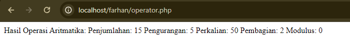
### Analisis

Program PHP di atas melakukan operasi aritmatika sederhana dengan menggunakan variabel `$a` dan `$b`, dan menampilkan hasilnya. Berikut adalah analisis singkat dari program tersebut:

1. **Deklarasi Variabel**: Dua variabel, `$a` dan `$b`, dideklarasikan dan diinisialisasi dengan nilai masing-masing. `$a` diinisialisasi dengan nilai 10, dan `$b` diinisialisasi dengan nilai 5.
    
2. **Operasi Aritmatika**:
    
    - `$penjumlahan`: Menyimpan hasil penjumlahan dari variabel `$a` dan `$b`.
    - `$pengurangan`: Menyimpan hasil pengurangan dari variabel `$a` dan `$b`.
    - `$perkalian`: Menyimpan hasil perkalian dari variabel `$a` dan `$b`.
    - `$pembagian`: Menyimpan hasil pembagian dari variabel `$a` dan `$b`.
    - `$modulus`: Menyimpan hasil modulus dari variabel `$a` dan `$b`.
3. **Output**:
    
    - Pesan "Hasil Operasi Aritmatika:" ditampilkan terlebih dahulu.
    - Kemudian, hasil dari penjumlahan, pengurangan, perkalian, pembagian, dan modulus ditampilkan dengan menggunakan perintah `echo`. Nilai-nilai variabel yang disertakan dalam output menggunakan interpolasi string.
### Kesimpulan

Kesimpulan dari program tersebut adalah untuk menampilkan hasil dari berbagai operasi aritmatika yang dilakukan terhadap dua variabel `$a` dan `$b`, yaitu penjumlahan, pengurangan, perkalian, pembagian, dan modulus.

## Perbandingan
### Penjelasan

Operator perbandingan di PHP digunakan untuk membandingkan dua nilai dan menghasilkan nilai kebenaran (true/false) berdasarkan hasil perbandingan tersebut. Operator perbandingan digunakan untuk mengevaluasi hubungan antara dua nilai atau ekspresi.

1. `==`: Sama dengan. Memeriksa apakah dua nilai sama.
2. `===`: Identik. Memeriksa apakah dua nilai identik, termasuk tipe data.
3. `!=` atau `<>`: Tidak sama dengan. Memeriksa apakah dua nilai tidak sama.
4. `!==`: Tidak identik. Memeriksa apakah dua nilai tidak identik, termasuk tipe data.
5. `>`: Lebih besar dari. Memeriksa apakah nilai di sebelah kiri lebih besar dari nilai di sebelah kanan.
6. `<`: Lebih kecil dari. Memeriksa apakah nilai di sebelah kiri lebih kecil dari nilai di sebelah kanan.
7. `>=`: Lebih besar dari atau sama dengan. Memeriksa apakah nilai di sebelah kiri lebih besar dari atau sama dengan nilai di sebelah kanan.
8. `<=`: Lebih kecil dari atau sama dengan. Memeriksa apakah nilai di sebelah kiri lebih kecil dari atau sama dengan nilai di sebelah kanan.
### Struktur 
### Program

```php
<?php

// Deklarasi variabel
$a = 10;
$b = 5;

// Operasi perbandingan
$hasil_sama_dengan = ($a == $b);
$hasil_lebih_besar = ($a > $b);
$hasil_lebih_kecil = ($a < $b);

// Tampilkan hasil perbandingan
echo "Hasil Perbandingan:\n";
echo "\$a == \$b : " . ($hasil_sama_dengan ? "True" : "False") . "\n";
echo "\$a > \$b  : " . ($hasil_lebih_besar ? "True" : "False") . "\n";
echo "\$a < \$b  : " . ($hasil_lebih_kecil ? "True" : "False") . "\n";

?>

```
### Hasil

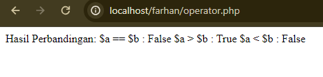
### Analisis

1. **Deklarasi Variabel**: Variabel `$a` dan `$b` dideklarasikan dengan nilai masing-masing 10 dan 5.
    
2. **Operasi Perbandingan**: Tiga operasi perbandingan dilakukan:
    
    - `$hasil_sama_dengan`: Memeriksa apakah nilai `$a` sama dengan nilai `$b`.
    - `$hasil_lebih_besar`: Memeriksa apakah nilai `$a` lebih besar dari nilai `$b`.
    - `$hasil_lebih_kecil`: Memeriksa apakah nilai `$a` lebih kecil dari nilai `$b`.
3. **Tampilkan Hasil Perbandingan**: Hasil dari masing-masing operasi perbandingan ditampilkan dengan menggunakan perintah `echo`. Jika hasil perbandingannya benar (true), maka akan menampilkan "True", dan jika salah (false), maka akan menampilkan "False".
### Kesimpulan

Kesimpulan dari program tersebut adalah untuk menunjukkan cara menggunakan operator perbandingan (`==`, `>`, `<`) dalam PHP untuk memeriksa hubungan antara dua nilai. Program ini memberikan contoh konkret bagaimana hasil dari operasi perbandingan dievaluasi dan ditampilkan kepada pengguna.
## Logika
### Penjelasan

Operator logika dalam PHP digunakan untuk menggabungkan dan memanipulasi nilai-nilai kebenaran (true/false) dari suatu kondisi atau ekspresi. Operator logika digunakan untuk membuat kondisi-kondisi kompleks yang melibatkan lebih dari satu ekspresi logis.

Berikut adalah operator logika yang digunakan dalam PHP:

1. **AND (`&&`)**: Operator AND menghasilkan nilai true jika kedua ekspresi atau kondisi yang diuji bernilai true. Jika salah satu atau kedua ekspresi bernilai false, maka hasilnya adalah false.
    
2. **OR (`||`)**: Operator OR menghasilkan nilai true jika salah satu dari dua ekspresi atau kondisi yang diuji bernilai true. Hanya jika kedua ekspresi tersebut bernilai false, hasilnya adalah false.
    
3. **NOT (`!`)**: Operator NOT digunakan untuk membalikkan nilai suatu ekspresi logika. Jika ekspresi bernilai true, NOT akan menghasilkan false, dan sebaliknya.
### Struktur 
### Program

```php
<?php

// Deklarasi variabel
$nilai1 = 10;
$nilai2 = 5;

// Operator logika AND
$hasil_and = ($nilai1 > 0) && ($nilai2 < 10);

// Operator logika OR
$hasil_or = ($nilai1 == 10) || ($nilai2 == 10);

// Operator logika NOT
$hasil_not_nilai1 = !($nilai1 == 10);
$hasil_not_nilai2 = !($nilai2 == 10);

// Tampilkan hasil operator logika
echo "Hasil Operator Logika:\n";
echo "Operator AND: " . ($hasil_and ? "True" : "False") . "\n";
echo "Operator OR : " . ($hasil_or ? "True" : "False") . "\n";
echo "Operator NOT untuk nilai1: " . ($hasil_not_nilai1 ? "True" : "False") . "\n";
echo "Operator NOT untuk nilai2: " . ($hasil_not_nilai2 ? "True" : "False") . "\n";

?>

```
### Hasil

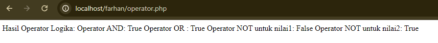
### Analisis

1. **Deklarasi Variabel**: Variabel `$nilai1` dan `$nilai2` dideklarasikan dengan nilai masing-masing 10 dan 5.
    
2. **Operator Logika AND**:
    
    - Dilakukan operasi logika AND (`&&`) antara `$nilai1 > 0` dan `$nilai2 < 10`.
    - Hasilnya adalah true jika kedua kondisi tersebut benar, yaitu `$nilai1` lebih besar dari 0 dan `$nilai2` lebih kecil dari 10.
3. **Operator Logika OR**:
    
    - Dilakukan operasi logika OR (`||`) antara `$nilai1 == 10` dan `$nilai2 == 10`.
    - Hasilnya adalah true jika salah satu dari kondisi tersebut benar, yaitu jika `$nilai1` sama dengan 10 atau `$nilai2` sama dengan 10.
4. **Operator Logika NOT**:
    
    - Dilakukan operasi logika NOT (`!`) pada variabel `$nilai1` dan `$nilai2`.
    - Hasilnya adalah true jika nilai variabel tersebut tidak sama dengan 10.
5. **Tampilkan Hasil Operator Logika**:
    
    - Hasil dari setiap operasi logika ditampilkan menggunakan perintah `echo`. Jika hasilnya true, maka akan menampilkan "True", dan jika false, maka akan menampilkan "False".
### Kesimpulan

Kesimpulan dari program tersebut adalah untuk menunjukkan cara menggunakan operator logika (`&&`, `||`, `!`) dalam PHP untuk memeriksa kondisi atau hubungan logis antara nilai atau ekspresi. Program ini memberikan contoh konkret bagaimana hasil dari operasi logika dievaluasi dan ditampilkan kepada pengguna.

# Conditional Statement
## IF
### Penjelasan

Pernyataan if digunakan untuk menjalankan blok kode jika kondisi yang diberikan benar (true)
### Struktur 

```php
if (kondisi) {
    // Blok kode yang dijalankan jika kondisi benar
}
```
### Program

```PHP
$nilai = 80;

if ($nilai >= 60) {
   echo "Selamat, Anda lulus!";
}
```
### Hasil


### Analisis

1. Variabel `$nilai` diberikan nilai 50.
2. Pernyataan if digunakan untuk menguji apakah nilai `$nilai` lebih besar atau sama dengan 60.
3. Karena nilai `$nilai` adalah 50 dan tidak memenuhi kondisi `$nilai >= 60`, blok kode di dalam if tidak akan dieksekusi.
4. Karena tidak ada blok kode di dalam if yang dieksekusi, program akan melanjutkan ke blok kode di dalam else.
5. Blok kode di dalam else berisi perintah untuk mencetak pesan "Maaf, Anda tidak lulus." menggunakan pernyataan echo.
6. Setelah blok kode di dalam else dieksekusi, program akan berakhir.
### Kesimpulan

Jika variabel `$nilai` memiliki nilai 80, maka kondisi `$nilai >= 60` akan benar, sehingga pesan "Selamat, Anda lulus!" akan ditampilkan.
## IF-ELSE
### Penjelasan

Pernyataan if-else digunakan untuk menjalankan blok kode tertentu jika kondisi benar (true), dan menjalankan blok kode lain jika kondisi salah (false).
### Struktur 

```php
if (kondisi) {
    // Blok kode yang dijalankan jika kondisi benar
} else {
    // Blok kode yang dijalankan jika kondisi salah
}
```
### Program

```php
$nilai = 50;

if ($nilai >= 60) {
    echo "Selamat, Anda lulus!";
} else {
    echo "Maaf, Anda tidak lulus.";
}
```
### Hasil

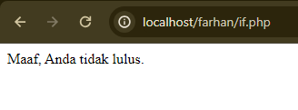
### Analisis

Variabel `$nilai` diberikan nilai 80.
2. Pernyataan if digunakan untuk menguji apakah nilai `$nilai` lebih besar atau sama dengan 60.
3. Karena nilai `$nilai` adalah 80 dan memenuhi kondisi `$nilai >= 60`, blok kode di dalam if akan dieksekusi.
4. Blok kode di dalam if hanya berisi perintah untuk mencetak pesan "Selamat, Anda lulus!" menggunakan pernyataan echo.
5. Setelah blok kode di dalam if dieksekusi, program akan berakhir.
### Kesimpulan

Jika variabel `$nilai` memiliki nilai 50, maka kondisi `$nilai >= 60` akan salah, sehingga pesan "Maaf, Anda tidak lulus." akan ditampilkan.

## IF-ELSE IF-ELSE
### Penjelasan

Pernyataan if-else-if-else digunakan ketika terdapat beberapa kondisi yang harus diuji secara berurutan.
### Struktur:

```php
if (kondisi1) {
    // Blok kode yang dijalankan jika kondisi1 benar
} elseif (kondisi2) {
    // Blok kode yang dijalankan jika kondisi2 benar
} else {
    // Blok kode yang dijalankan jika semua kondisi salah
}
```
### Program

```php
$nilai = 75;

if ($nilai >= 80) {
    echo "Selamat, Anda mendapatkan nilai A!";
} elseif ($nilai >= 70) {
    echo "Anda mendapatkan nilai B.";
} elseif ($nilai >= 60) {
    echo "Anda mendapatkan nilai C.";
} else {
    echo "Maaf, Anda tidak lulus.";
}
```
### Hasil

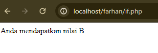

### Analisis
1. Variabel `$nilai` diberikan nilai 75.
2. Pernyataan if pertama digunakan untuk menguji apakah nilai `$nilai` lebih besar atau sama dengan 80.
3. Karena nilai `$nilai` tidak mencapai 80, maka blok kode di dalam if pertama tidak akan dieksekusi.
4. Pernyataan elseif pertama digunakan untuk menguji apakah nilai `$nilai` lebih besar atau sama dengan 70.
5. Karena nilai `$nilai` adalah 75 dan memenuhi kondisi `$nilai >= 70`, blok kode di dalam elseif pertama akan dieksekusi.
6. Blok kode di dalam elseif pertama mencetak pesan "Anda mendapatkan nilai B." menggunakan pernyataan echo.
7. Setelah blok kode di dalam elseif pertama dieksekusi, program akan keluar dari struktur kondisional dan berakhir.
### Kesimpulan
Jika variabel `$nilai` memiliki nilai 75, maka kondisi `$nilai >= 80` akan salah, namun kondisi `$nilai >= 70` akan benar. Oleh karena itu, pesan "Anda mendapatkan nilai B." akan ditampilkan
## Switch-Case
### Penjelasan
Pernyataan switch case digunakan ketika terdapat beberapa pilihan yang harus diuji.
### Struktur
```php
switch (ekspresi) {
    case nilai1:
        // Blok kode yang dijalankan jika ekspresi sama dengan nilai1
        break;
    case nilai2:
        // Blok kode yang dijalankan jika ekspresi sama dengan nilai2
        break;
    default:
        // Blok kode yang dijalankan jika tidak ada case yang cocok
        break;
}
```
### Program
```php
$hari = "Senin";

switch ($hari) {
    case "Senin":
        echo "Hari ini adalah hari Senin.";
        break;
    case "Selasa":
        echo "Hari ini adalah hari Selasa.";
        break;
    default:
        echo "Hari ini bukan hari Senin atau Selasa.";
        break;
}
```
### Hasil

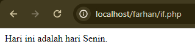
### Analisis
1. Variabel `$hari` diberikan nilai "Senin".
2. Pernyataan switch digunakan untuk memeriksa nilai dari variabel `$hari`.
3. Kasus pertama (`case "Senin"`) akan dieksekusi jika nilai `$hari` adalah "Senin".
4. Karena nilai `$hari` adalah "Senin", blok kode di dalam kasus pertama akan dieksekusi.
5. Blok kode di dalam kasus pertama mencetak pesan "Hari ini adalah hari Senin." menggunakan pernyataan echo.
6. Setelah blok kode di dalam kasus pertama selesai dieksekusi, pernyataan break digunakan untuk menghentikan eksekusi struktur switch.
7. Program akan keluar dari struktur switch dan berakhir.

### Kesimpulan
ika variabel `$hari` memiliki nilai "Senin", maka case pertama akan cocok, dan pesan "Hari ini adalah hari Senin." akan ditampilkan.
# Array
## Array 1 dimensi
### Penjelasan
Array satu dimensi adalah kumpulan nilai yang disimpan dalam satu variabel dengan indeks berurutan secara numerik.
### Struktur 
```php
$array = array(nilai1, nilai2, nilai3);
```
### Program
```php
$buah = array("Apel", "Jeruk", "Mangga");
echo $buah[0]; // Output: Apel
echo $buah[1]; // Output: Jeruk
echo $buah[2]; // Output: Mangga
```
### Hasil
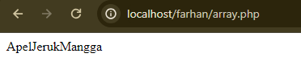
### Analisis
1. Baris pertama mendefinisikan variabel `$buah` sebagai array dengan tiga elemen: "Apel", "Jeruk", dan "Mangga".
2. Baris kedua (`echo $buah[0];`) mencetak nilai buah yang berada pada indeks 0, yaitu "Apel".
3. Baris ketiga (`echo $buah[1];`) mencetak nilai buah yang berada pada indeks 1, yaitu "Jeruk".
4. Baris keempat (`echo $buah[2];`) mencetak nilai buah yang berada pada indeks 2, yaitu "Mangga".
### Kesimpulan
Program ini menggunakan array satu dimensi untuk menyimpan dan mengakses kumpulan nilai buah. Dengan menggunakan indeks numerik, kita dapat mengakses nilai buah tertentu dalam array. Dalam contoh ini, program mencetak nilai buah "Apel", "Jeruk", dan "Mangga" sesuai dengan indeks yang ditentukan.
## Array Asosiatif

### Penjelasan

Array asosiatif adalah kumpulan nilai yang disimpan dalam satu variabel dengan indeks berupa kunci (key) yang dapat ditentukan sendiri.
### Struktur 

```php
$array = array(
    "kunci1" => nilai1,
    "kunci2" => nilai2,
    "kunci3" => nilai3,
    ...
);
```
### Program

```php
$mahasiswa = array(
    "nama" => "John Doe",
    "nim" => "123456",
    "jurusan" => "Teknik Informatika"
);
echo $mahasiswa["nama"]; // Output: John Doe
echo $mahasiswa["nim"]; // Output: 123456
echo $mahasiswa["jurusan"]; // Output: Teknik Informatika
```
### Hasil

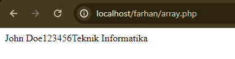
### Analisis

1. Baris pertama mendefinisikan variabel `$mahasiswa` sebagai array asosiatif dengan tiga pasangan kunci-nilai: "nama" dengan nilai "John Doe", "nim" dengan nilai "123456", dan "jurusan" dengan nilai "Teknik Informatika".
2. Baris kedua (`echo $mahasiswa["nama"];`) mencetak nilai yang terkait dengan kunci "nama", yaitu "John Doe".
3. Baris ketiga (`echo $mahasiswa["nim"];`) mencetak nilai yang terkait dengan kunci "nim", yaitu "123456".
4. Baris keempat (`echo $mahasiswa["jurusan"];`) mencetak nilai yang terkait dengan kunci "jurusan", yaitu "Teknik Informatika".
### Kesimpulan
Program ini menggunakan array asosiatif untuk menyimpan dan mengakses informasi tentang seorang mahasiswa. Dengan menggunakan kunci yang ditentukan sendiri, kita dapat mengakses nilai-nilai yang terkait dengan kunci tersebut dalam array. Dalam contoh ini, program mencetak informasi nama, nim, dan jurusan mahasiswa sesuai dengan kunci yang ditentukan.
## Array Multidimensi
### Penjelasan

Array multidimensi adalah array yang berisi array di dalamnya, sehingga membentuk struktur data berlapis.
### Struktur

```php
$array = array(
    array(nilai1, nilai2, nilai3, ...),
    array(nilai4, nilai5, nilai6, ...),
    ...
);
```
### Program
```php
$matriks = array(
    array(1, 2, 3),
    array(4, 5, 6),
    array(7, 8, 9)
);
echo $matriks[0][0]; // Output: 1
echo $matriks[1][1]; // Output: 5
echo $matriks[2][2]; // Output: 9
```
### Hasil
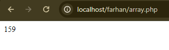
### Analisis
1. Baris pertama mendefinisikan variabel `$matriks` sebagai array multidimensi yang terdiri dari tiga array dalam array. Setiap array dalam array tersebut merepresentasikan satu baris dalam matriks.
    - Baris pertama matriks: array(1, 2, 3)
    - Baris kedua matriks: array(4, 5, 6)
    - Baris ketiga matriks: array(7, 8, 9)
2. Baris kedua (`echo $matriks[0][0];`) mencetak nilai yang terletak pada baris pertama (indeks 0) dan kolom pertama (indeks 0) dalam matriks. Outputnya adalah 1.
3. Baris ketiga (`echo $matriks[1][1];`) mencetak nilai yang terletak pada baris kedua (indeks 1) dan kolom kedua (indeks 1) dalam matriks. Outputnya adalah 5.
4. Baris keempat (`echo $matriks[2][2];`) mencetak nilai yang terletak pada baris ketiga (indeks 2) dan kolom ketiga (indeks 2) dalam matriks. Outputnya adalah 9.
### Kesimpulan
Program ini menggunakan array multidimensi untuk menyimpan dan mengakses matriks angka. Dengan menggunakan indeks berlapis, kita dapat mengakses nilai-nilai yang terletak pada baris dan kolom tertentu dalam matriks. Dalam contoh ini, program mencetak nilai-nilai dalam matriks sesuai dengan indeks yang ditentukan.
# Var_dump

## Penjelasan

Fungsi `var_dump()` adalah fungsi bawaan dalam PHP yang digunakan untuk menampilkan informasi terperinci tentang satu atau lebih variabel, termasuk tipe data dan nilai. Fungsi ini sangat berguna untuk debugging kode PHP dan memahami struktur data dari variabel yang digunakan dalam program.

Ketika Anda menggunakan `var_dump()`, hasilnya akan mencakup tipe data dari variabel tersebut (seperti integer, string, array, boolean, dll.) serta nilai yang disimpan di dalamnya. Ini memberikan pandangan lengkap tentang variabel yang sedang diperiksa, membantu dalam identifikasi masalah dan memastikan variabel memiliki nilai yang diharapkan.
## Struktur 

```php
<?php

  

// Deklarasi variabel

$angka = nilai1;

$kata = "nilai1";

$array = array(nilai1, nilai2, nilai3, nilai4, nilai5);

  

// Menampilkan informasi variabel menggunakan var_dump

var_dump($angka);

var_dump($kata);

var_dump($array);

  

?>
```
## Program

```php
<?php

  

// Deklarasi variabel

$angka = 10;

$kata = "Hello, world!";

$array = array(1, 2, 3, 4, 5);

  

// Menampilkan informasi variabel menggunakan var_dump

var_dump($angka);

var_dump($kata);

var_dump($array);

  

?>
```
## Hasil

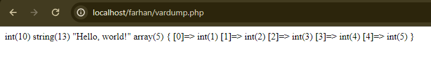
## Analisis

1. Variabel `$angka`: Merupakan variabel bertipe integer dengan nilai 10. Ketika dipanggil dengan `var_dump()`, hasilnya akan mencantumkan tipe datanya sebagai "int" dan nilai 10.
    
2. Variabel `$kata`: Merupakan variabel bertipe string dengan nilai "Hello, world!". Ketika dipanggil dengan `var_dump()`, hasilnya akan mencantumkan tipe datanya sebagai "string" dan nilai "Hello, world!".
    
3. Variabel `$array`: Merupakan variabel bertipe array dengan isi [1, 2, 3, 4, 5]. Ketika dipanggil dengan `var_dump()`, hasilnya akan mencantumkan tipe datanya sebagai "array" dan menampilkan indeks serta nilai dari setiap elemen array.
## Kesimpulan 

Program ini menunjukkan cara menggunakan `var_dump()` untuk mendapatkan informasi detail tentang tipe data dan nilai dari berbagai jenis variabel dalam PHP. Dengan menggunakan `var_dump()`, pengembang dapat dengan cepat memeriksa dan memahami struktur data dari variabel mereka, yang sangat berguna untuk debugging dan pengembangan kode.
# Looping (Perulangan)
## For
### Penjelasan
Perulangan for digunakan ketika kita mengetahui jumlah iterasi yang akan dilakukan.
### Struktur 

```php
for (inisialisasi; kondisi; perubahan) {
    // Blok kode yang akan diulang
}

```
### Program

```php
<?php

  

for($i = 0; $i < 10; $i++){

 echo "<h2>Ini perulangan ke-$i</h2>";

}
```
### Hasil

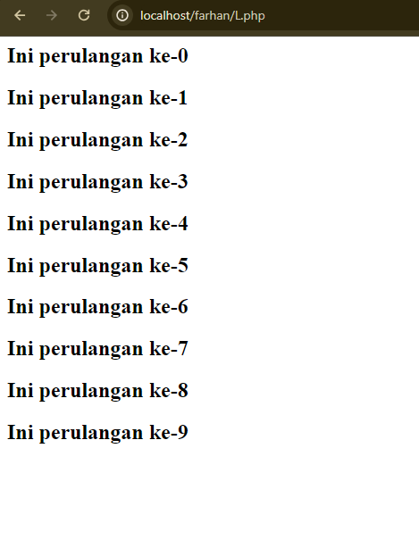
### Analisis

1. Penginisialisasian variabel: Pada baris pertama ($i = 0), variabel $i diinisialisasi dengan nilai 0. Ini merupakan langkah awal sebelum perulangan dimulai.
2. Kondisi perulangan: Pada baris kedua ($i < 10), terdapat kondisi perulangan yang mengevaluasi apakah nilai $i masih kurang dari 10. Jika kondisi ini bernilai benar (true), perulangan akan dilakukan. Jika kondisi ini bernilai salah (false), perulangan akan berhenti.
3. Pernyataan iterasi: Setiap kali satu iterasi perulangan selesai, pernyataan $i++ pada baris ketiga akan dieksekusi. Pernyataan ini bertujuan untuk menambahkan nilai $i sebesar 1 setiap kali iterasi berlangsung. Dengan demikian, variabel $i akan terus bertambah hingga mencapai batas kondisi perulangan.
### Kesimpulan

Program di atas adalah contoh kode dalam bahasa pemrograman PHP yang menggunakan loop `for` untuk melakukan iterasi sebanyak 10 kali. Setiap iterasi, program mencetak teks "`<h2>Ini perulangan ke-$i</h2>`" di mana `$i` merupakan nomor iterasi saat itu. Dengan demikian, program ini akan menghasilkan 10 baris teks dengan nomor iterasi yang berbeda, dimulai dari 0 hingga 9.
## While
### Penjelasan

Perulangan while digunakan ketika kita ingin melakukan iterasi selama kondisi bernilai true.
### Struktur 

```php
while (kondisi) {
    // blok kode yang akan diulang
    // perubahan kondisi harus dilakukan di dalam blok kode
}
```
### Program

```php
$i = 1;
while ($i <= 5) {
    echo $i;
    $i++;
}
```
### Hasil

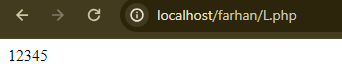
### Analisis

- Pada awal program, variabel `$i` diinisialisasi dengan nilai 1.
- Kondisi perulangan adalah `$i <= 5`, yang berarti perulangan akan terus berjalan selama nilai `$i` kurang dari atau sama dengan 5.
- Setiap kali iterasi perulangan dilakukan, blok kode di dalamnya akan dijalankan. Pada contoh ini, blok kode mencetak nilai `$i` menggunakan perintah `echo`.
- Setelah blok kode dijalankan, variabel `$i` akan bertambah satu menggunakan operator penambahan `$i++`.
- Proses ini akan terus berlanjut selama kondisi perulangan terpenuhi, yaitu saat nilai `$i` kurang dari atau sama dengan 5.
- Output dari program ini akan mencetak angka 1 sampai 5 secara berurutan.
### Kesimpulan
Program ini akan mencetak angka dari 1 sampai 5. Perulangan `while` akan menjalankan blok kode di dalamnya selama kondisi `$i <= 5` bernilai `true`. Setiap iterasi, angka `$i` akan ditampilkan menggunakan perintah `echo`. Variabel `$i` akan terus bertambah satu setiap kali iterasi dengan menggunakan operator penambahan `$i++`.
## Do-While

### Penjelasan

Perulangan do while mirip dengan perulangan while, namun blok kode akan dijalankan setidaknya satu kali sebelum melakukan pengecekan kondisi.
### Struktur 

```php
do {
    // blok kode yang akan diulang
    // perubahan kondisi harus dilakukan di dalam blok kode
} while (kondisi);
```
### Program

```php
$ulangi = 10;
do {
    echo "<p>ini adalah perulangan ke-$ulangi</p>";
    $ulangi--;
} while ($ulangi > 0);
```
### Hasil
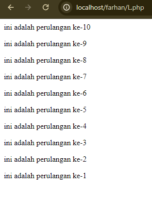
### Analisis
- - Awalnya, variabel `$ulangi` diinisialisasi dengan nilai 10.
- Kemudian, blok perintah dalam `do` dijalankan, mencetak pesan dengan nomor iterasi saat itu.
- Setelah itu, nilai `$ulangi` dikurangi 1 dengan pernyataan `$ulangi--;`.
- Pada bagian `while`, kondisi `$ulangi > 0` diperiksa. Jika kondisi tersebut benar (nilai `$ulangi` masih di atas 0), maka loop akan terus berlanjut.
- Loop akan berhenti saat nilai `$ulangi` mencapai 0.
### Kesimpulan

Loop `do-while` menjamin bahwa setidaknya satu iterasi akan dieksekusi sebelum kondisi di dalamnya dievaluasi. Di sini, loop akan terus berjalan selama nilai `$ulangi` lebih besar dari 0.

Kesimpulannya, program ini akan menghasilkan output yang mirip dengan loop sebelumnya, hanya saja iterasinya dimulai dari 10 dan berkurang hingga 1.
## Foreach
### Penjelasan

Foreach adalah sebuah konstruksi pengulangan yang digunakan dalam pemrograman untuk mengulang elemen-elemen dalam sebuah array atau objek yang dapat diiterasi. Konstruksi foreach dapat digunakan untuk mengakses setiap elemen dalam struktur data tersebut tanpa perlu menggunakan indeks.
### Struktur 

```php
foreach ($array as $nilai) {
    // Blok kode yang akan diulang
}
```
### Program

```php
<?php

  

$books = [

     "air hangat",

     "kopi",

     "gula",

     "teh"

    ];

    echo "<h5>bahan bahan:</h5>";

    echo "<ul>";

    foreach($books as $buku){

    echo "<li>$buku</li>";

    }

    echo "</ul>";
```
### Hasil

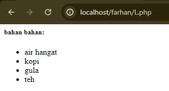
### Analisis

Program di atas adalah contoh kode dalam bahasa pemrograman PHP yang menggunakan array untuk menyimpan daftar bahan-bahan. Array `$books` dibuat dengan empat elemen, yaitu "air hangat", "kopi", "gula", dan "teh".

Selanjutnya, program mencetak judul "`<h5>bahan bahan:</h5>`" diikuti dengan pembukaan tag `<ul>` untuk membuat daftar tidak berurut (unordered list) dalam HTML.

Loop `foreach` digunakan untuk mengakses setiap elemen dari array `$books`. Setiap elemen disimpan dalam variabel `$buku`, dan kemudian dicetak menggunakan tag `<li>`, yang menandakan setiap item dalam daftar tidak berurut.

Setelah selesai mencetak semua elemen array, program menutup daftar dengan menambahkan penutup tag `</ul>`.

Hasil akhirnya adalah sebuah daftar HTML yang menampilkan judul "bahan bahan:" diikuti dengan elemen-elemen dari array `$books`.
### Kesimpulan

Kesimpulannya, program ini menghasilkan daftar HTML yang menampilkan judul "bahan bahan:" diikuti dengan elemen-elemen dari array `$books` dalam bentuk daftar tidak berurut.
# Function

## Penjelasan

Fungsi (function) dalam pemrograman adalah blok kode yang dirancang untuk melakukan tugas tertentu atau menghasilkan suatu output ketika dipanggil. Fungsi membantu dalam mengorganisir dan memecah kode ke dalam bagian-bagian yang lebih kecil dan terstruktur, yang dapat digunakan kembali di berbagai bagian dari program.
## Struktur 

```php
function greet($parameter1) { echo "Hello, $parameter1!"; }
```
## Program

```php
<?php

  

// Mendefinisikan fungsi

function greet($name) {

    echo "Hello, $name!";

}

  

// Memanggil fungsi

greet("John");

echo "\n";

greet("Alice");

  

?>
```
## Hasil

![[function.png]]
## Analisis

1. **Pendefinisian Fungsi**: Fungsi `greet()` didefinisikan dengan menggunakan kata kunci `function`, diikuti oleh nama fungsi dan parameter `$name` yang diterima oleh fungsi. Di dalam fungsi, pesan sapaan "Hello, $name!" dicetak ke layar menggunakan pernyataan `echo`.
    
2. **Pemanggilan Fungsi**: Fungsi `greet()` dipanggil dua kali dengan argumen yang berbeda ("John" dan "Alice"). Setiap kali fungsi dipanggil, argumen yang diberikan akan digunakan sebagai nilai untuk parameter `$name` di dalam fungsi.
## Kesimpulan

Program ini menunjukkan cara mendefinisikan dan menggunakan fungsi dalam PHP. Dengan menggunakan fungsi, kita dapat mengorganisir dan memecah kode ke dalam bagian-bagian yang lebih kecil dan terstruktur. Fungsi juga memungkinkan kita untuk menulis kode yang dapat digunakan kembali, mengurangi duplikasi kode, dan membuat kode lebih mudah dipelihara. Dengan menggunakan fungsi, kita dapat memisahkan logika bisnis dari bagian lain dari aplikasi, meningkatkan keterbacaan, dan mempercepat pengembangan aplikasi.
# Php Form
## Get Method
### Penjelasan

Metode GET adalah salah satu cara untuk mengirimkan data dari sisi klien (browser) ke sisi server (PHP) melalui URL. Data yang dikirimkan melalui metode GET akan terlihat dalam URL.
### Struktur 
### Program

**Form**
```php

<!DOCTYPE html>

<html lang="en">

  

<head>

    <title>Document</title>

</head>

  

<body>

    <!-- Pada atribut action, kalian tuliskan nama file php yang bertugas untuk mengelola atau menangkap data dari form tersebut. -->

    <form action="proses_get.php" method="GET">

        <input type="text" name="nama_lengkap" placeholder="Masukkan nama">

        <input type="number" name="umur" placeholder="Masukkan umur"> <br>

        <button type="submit">Kirim</button>

    </form>

</body>

  

</html>
```

**Proses**

```php

<?php

// Key dari array-nya, sesuai dengan nama dari atribut name di setiap input-nya

//$nama = $_GET["nama_lengkap"];

$umur = $_GET["umur"];

?>

  

<!DOCTYPE html>

<html lang="en">

  

<head>

    <meta charset="UTF-8">

    <meta name="viewport" content="width=device-width, initial-scale=1.0">

    <title>Farhan - XI RPL 1 - GET</title>

</head>

  

<body>

    <p>Nama anda

        <!-- Ini adalah versi singkatnya dari php echo,

             yang fungsinya untuk menampilkan data -->

        <?= $_GET["nama_lengkap"] ?>

    </p>

    <p>Umur anda <?= $umur ?> tahun</p>

</body>

  

</html>
```
### Hasil

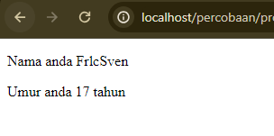
### Analisis

**Form**
Berdasarkan kode HTML yang diberikan, program ini merupakan sebuah halaman web yang memiliki sebuah form sederhana. Berikut analisis dan kesimpulan dari program tersebut:

1. **Tujuan Program**:
    
    - Program ini bertujuan untuk mengumpulkan data dari pengguna, yaitu nama lengkap dan umur.
2. **Struktur Program**:
    
    - Halaman web ini memiliki elemen `<form>` yang digunakan untuk membuat form input.
    - Dalam elemen `<form>`, terdapat dua input field, yaitu "Masukkan nama" (tipe `text`) dan "Masukkan umur" (tipe `number`).
    - Terdapat juga sebuah tombol "Kirim" (tipe `submit`) yang akan mengirimkan data dari form ke file PHP yang ditentukan pada atribut `action`.
3. **Pengiriman Data**:
    
    - Data yang dimasukkan oleh pengguna pada form akan dikirimkan ke file PHP bernama "proses_get.php" menggunakan metode HTTP GET.
    - Penggunaan metode GET menyebabkan data yang dikirimkan akan ditampilkan pada URL, sehingga perlu dipertimbangkan masalah keamanan jika data yang dikirim bersifat sensitif.

**Proses**

Berdasarkan kode PHP dan HTML yang diberikan, program ini merupakan sebuah halaman web yang menerima data dari form sebelumnya dan menampilkannya. Berikut analisis dan kesimpulan dari program tersebut:

1. **Tujuan Program**:
    
    - Program ini bertujuan untuk menerima dan menampilkan data yang dikirimkan dari form sebelumnya.
2. **Struktur Program**:
    
    - Pada bagian PHP, terdapat dua variabel yang digunakan untuk menyimpan data yang dikirimkan melalui metode HTTP GET, yaitu `$_GET["nama_lengkap"]` dan `$_GET["umur"]`.
    - Pada bagian HTML, terdapat dua elemen `<p>` yang digunakan untuk menampilkan data nama lengkap dan umur yang diterima dari form sebelumnya.
    - Penggunaan `<?= ?>` adalah versi singkat dari `<?php echo ?>` yang berfungsi untuk menampilkan nilai dari variabel.
3. **Pengolahan Data**:
    
    - Data yang diterima dari form sebelumnya melalui metode HTTP GET disimpan dalam variabel `$_GET["nama_lengkap"]` dan `$_GET["umur"]`.
    - Data tersebut kemudian ditampilkan pada halaman web menggunakan elemen `<p>`.
### Kesimpulan
1
- Program ini merupakan sebuah halaman web sederhana yang memiliki form untuk mengumpulkan data nama lengkap dan umur pengguna.
- Data yang dimasukkan akan dikirimkan ke file PHP "proses_get.php" menggunakan metode HTTP GET.
- Perlu diperhatikan masalah keamanan jika data yang dikirim bersifat sensitif, karena metode GET akan menampilkan data pada URL.
- Untuk pengembangan lebih lanjut, dapat dipertimbangkan penggunaan metode POST untuk mengirimkan data secara lebih aman.
2
- Program ini merupakan lanjutan dari program form sebelumnya, yang berfungsi untuk menerima dan menampilkan data yang dikirimkan dari form.
- Data yang diterima melalui metode HTTP GET disimpan dalam variabel `$_GET` dan kemudian ditampilkan pada halaman web.
- Penggunaan metode GET untuk mengirimkan data perlu diperhatikan dari segi keamanan, karena data dapat dilihat dalam URL.
- Untuk pengembangan lebih lanjut, dapat dipertimbangkan penggunaan metode POST untuk mengirimkan data secara lebih aman.
## Post Method
### Penjelasan

Metode POST adalah salah satu cara untuk mengirimkan data dari sisi klien (browser) ke sisi server (PHP) melalui body request HTTP. Data yang dikirimkan melalui metode POST tidak akan terlihat dalam URL.
### Struktur 
### Program

**Form**
```php
<!DOCTYPE html>

<html lang="en">

  

<head>

    <title>Document</title>

</head>

  

<body>

    <!-- Pada atribut action, kalian tuliskan nama file php yang bertugas untuk mengelola atau menangkap data dari form tersebut. -->

    <form action="proses_post.php" method="POST">

        <input type="text" name="nama_lengkap" placeholder="Masukkan nama">

        <input type="number" name="umur" placeholder="Masukkan umur">

        <input type="password" name="password" placeholder="Masukkan password"><br>

        <button type="submit">Kirim</button>

    </form>

</body>

  

</html>
```


**Proses**
```php
<?php

// Key dari array-nya, sesuai dengan nama dari atribut name di setiap input-nya

//$nama = $_GET["nama"];

$umur = $_POST["umur"];

  

var_dump($_POST);

  

?>

  

<!DOCTYPE html>

<html lang="en">

  

<head>

    <title> XI RPL 1 - POST</title>

</head>

  

<body>

    <p>Nama anda <?= $_POST["nama_lengkap"] ?></p>

    <p>Umur anda <?= $umur ?> tahun</p>

    <p>Password anda aman!</p>

</body>

  

</html>
```
### Hasil

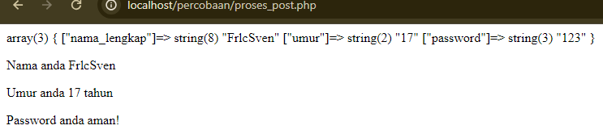
### Analisis

**Form**
1. **Tujuan Program**:
    
    - Program ini bertujuan untuk menyediakan sebuah form untuk mengumpulkan data dari pengguna, yang akan dikirimkan ke file PHP lain untuk diproses.
2. **Struktur Program**:
    
    - Pada bagian `<form>`, terdapat tiga buah input field yang digunakan untuk mengumpulkan data dari pengguna, yaitu "Masukkan nama", "Masukkan umur", dan "Masukkan password".
    - Atribut `action` pada elemen `<form>` menentukan file PHP yang akan menerima dan mengelola data yang dikirimkan dari form ini, yaitu `proses_post.php`.
    - Atribut `method` pada elemen `<form>` menentukan metode HTTP yang akan digunakan untuk mengirimkan data, yaitu `POST`.
    - Terdapat satu buah tombol `<button>` bertipe "submit" yang akan mengirimkan data dari form ke file PHP yang ditentukan dalam atribut `action`.
3. **Penggunaan Form**:
    
    - Pengguna dapat mengisi data pada form, yang terdiri dari "Masukkan nama", "Masukkan umur", dan "Masukkan password".
    - Setelah pengguna mengisi data dan menekan tombol "Kirim", data akan dikirimkan ke file PHP `proses_post.php` menggunakan metode HTTP POST.

**Proses**
1. **Tujuan Program**:
    
    - Program ini bertujuan untuk menerima dan menampilkan data yang dikirimkan dari form menggunakan metode POST.
2. **Struktur Program**:
    
    - Pada bagian PHP, terdapat dua variabel yang digunakan untuk menyimpan data yang dikirimkan melalui metode HTTP POST, yaitu `$_POST["nama_lengkap"]` dan `$_POST["umur"]`.
    - Terdapat juga perintah `var_dump($_POST)` yang digunakan untuk mencetak isi dari variabel `$_POST` untuk tujuan debugging.
    - Pada bagian HTML, terdapat tiga elemen `<p>` yang digunakan untuk menampilkan data nama lengkap, umur, dan pesan "Password anda aman!".
    - Penggunaan `<?= ?>` adalah versi singkat dari `<?php echo ?>` yang berfungsi untuk menampilkan nilai dari variabel.
3. **Pengolahan Data**:
    
    - Data yang diterima dari form sebelumnya melalui metode HTTP POST disimpan dalam variabel `$_POST["nama_lengkap"]` dan `$_POST["umur"]`.
    - Data tersebut kemudian ditampilkan pada halaman web menggunakan elemen `<p>`.
    - Perintah `var_dump($_POST)` digunakan untuk mencetak isi dari variabel `$_POST`, yang dapat berguna untuk keperluan debugging.
### Kesimpulan
1
- Program ini merupakan sebuah form HTML yang digunakan untuk mengumpulkan data dari pengguna.
- Data yang diisi oleh pengguna akan dikirimkan ke file PHP `proses_post.php` menggunakan metode HTTP POST.
- Metode POST digunakan untuk mengirimkan data secara lebih aman daripada metode GET, karena data tidak akan ditampilkan pada URL.
- File PHP `proses_post.php` harus ada dan digunakan untuk menerima dan mengelola data yang dikirimkan dari form ini.
- Secara keseluruhan, program ini merupakan contoh penggunaan form HTML untuk mengumpulkan data dari pengguna dan mengirimkannya ke file PHP untuk diproses lebih lanjut.

2
- Program ini merupakan lanjutan dari program form sebelumnya, yang berfungsi untuk menerima dan menampilkan data yang dikirimkan dari form menggunakan metode HTTP POST.
- Data yang diterima melalui metode HTTP POST disimpan dalam variabel `$_POST` dan kemudian ditampilkan pada halaman web.
- Penggunaan metode POST untuk mengirimkan data lebih aman daripada metode GET, karena data tidak akan ditampilkan pada URL.
- Perintah `var_dump($_POST)` digunakan untuk mencetak isi dari variabel `$_POST`, yang dapat berguna untuk keperluan debugging.
- Secara keseluruhan, program ini merupakan contoh penggunaan metode POST untuk mengirimkan dan menerima data dari form.